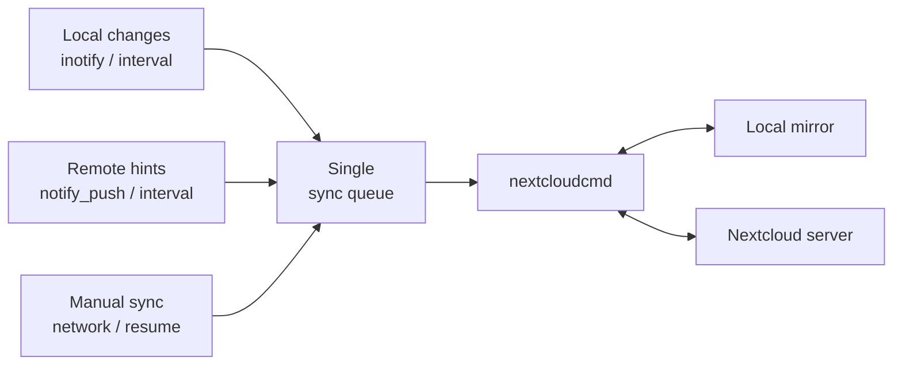

<div align="center">
  
  <h1>PyNextCloud Sync</h1>
  <p><strong>Your files, local. Your Nextcloud, in sync.</strong></p>
  <p>A lightweight, GNOME-native desktop companion for keeping one complete physical copy of a Nextcloud account on Linux.</p>
  <p>
    <a href="README.pt-BR.md">Português (Brasil)</a>
    ·
    <a href="https://eduhcommerce.com.br">Website</a>
    ·
    <a href="https://github.com/ehstbr/PyNextCloud-Sync/releases">Releases</a>
    ·
    <a href="https://github.com/ehstbr/PyNextCloud-Sync/issues">Report an issue</a>
  </p>
  <p>
    
    
    
    
    
  </p>
</div>

<p align="center">
  
</p>

## A small app with one clear job

PyNextCloud Sync keeps **one Nextcloud account** mirrored to **one local folder**. It deliberately avoids selective-sync rules, virtual files, multiple account trees, dashboards, and unrelated cloud features.

The actual bidirectional reconciliation is performed by the official [`nextcloudcmd`](https://github.com/nextcloud/desktop) engine. PyNextCloud Sync adds the desktop experience around it: secure login, automatic triggers, a compact status window, GNOME integration, logs, and a tray menu.

### Highlights

- **Complete physical mirror:** every eligible file in the account is kept locally.
- **Multiple accounts:** each account keeps its own synchronization and runtime settings, shown in a dedicated sidebar and per-account tray menu.
- **Official synchronization engine:** `nextcloudcmd` owns sync, conflict resolution, and safety. PyNextCloud Sync is a thin GNOME companion around it.
- **GNOME-native interface:** GTK 4 and Libadwaita, with a compact and familiar layout.
- **Secure sign-in:** Nextcloud Login Flow v2 or manual credentials, stored through Secret Service / GNOME Keyring.
- **Fast local detection:** recursive Linux `inotify` monitoring with event coalescing.
- **Remote change awareness:** optional `notify_push`, backed by a configurable remote interval.
- **Low-noise background operation:** one coalescing queue and at most one `nextcloudcmd` process.
- **First-sync confirmation:** before the initial run you confirm when the local folder, the remote folder, or both are empty.
- **Conflicted-copy resolver:** a window that lists the `* (Nextcloud conflicted copy <date>).*` files the engine preserves, with keep/restore and open actions.
- **Live progress:** the current file and processed count appear in the main window and tray during a sync.
- **Useful desktop integration:** Files sidebar bookmark, Desktop shortcut, custom folder icon, autostart, notifications, and tray controls.
- **Private by design:** no telemetry, analytics, advertisements, or remote crash reporting.
- **Multilingual:** English source interface with Brazilian Portuguese and Spanish translations.

## Screenshots

<table>
  <tr>
    <td width="50%" align="center"><strong>GNOME-oriented settings</strong><br></td>
    <td width="50%" align="center"><strong>Independent sync triggers</strong><br></td>
  </tr>
  <tr>
    <td width="50%" align="center"><strong>Network and account controls</strong><br></td>
    <td width="50%" align="center"><strong>Local logs and diagnostics</strong><br></td>
  </tr>
  <tr>
    <td width="50%" align="center"><strong>Optional update</strong><br></td>
    <td width="50%" align="center"><strong>Mandatory update</strong><br></td>
  </tr>
</table>

<p align="center">
  <strong>Everything important is also available from the tray</strong><br><br>
  
</p>

<details>
<summary><strong>View the first-run setup</strong></summary>
<br>
<table>
  <tr>
    <td width="50%"></td>
    <td width="50%"></td>
  </tr>
  <tr>
    <td width="50%"></td>
    <td width="50%"></td>
  </tr>
  <tr>
    <td width="50%"></td>
    <td width="50%"></td>
  </tr>
</table>
</details>

## How synchronization works

Every trigger asks the same scheduler for a bidirectional reconciliation. Requests that arrive together are coalesced, and the app never intentionally starts two `nextcloudcmd` processes for the same account.



`notify_push` sends only a hint that something may have changed. File discovery, transfer, conflict handling, and deletion propagation remain the responsibility of `nextcloudcmd`.

> [!IMPORTANT]
> Synchronization is bidirectional. Local and remote changes—including deletions—can be propagated to the other side. Keep an independent backup of important data and do not run another synchronization engine against the same local folder.

## Installation

### Debian package — recommended

Download the `.deb` from the [latest release](https://github.com/ehstbr/PyNextCloud-Sync/releases/latest), then install it with APT so the required system packages are resolved automatically:

```bash
cd ~/Downloads
sudo apt update
sudo apt install ./pynextcloud-sync_3.0.0_all.deb
```

During an interactive upgrade started with `sudo apt install`, the package asks a running PyNextCloud Sync instance to quit normally, waits for any current synchronization to finish, and restarts the updated application in the same desktop session. It never force-kills the synchronization process. Non-interactive upgrades or installations without an identifiable desktop session leave process control to the user or system administrator.

The package depends on `nextcloud-desktop-cmd`, Python 3, GTK 4, Libadwaita, PyGObject, libsoup, libsecret, GdkPixbuf, and GNOME Keyring. On GNOME, tray icons normally require an AppIndicator/StatusNotifier extension; synchronization continues even when no tray host is available.

### Source ZIP

Install the runtime dependencies first:

```bash
sudo apt update
sudo apt install \
  python3 python3-gi \
  gir1.2-gtk-4.0 gir1.2-adw-1 gir1.2-gdkpixbuf-2.0 \
  gir1.2-soup-3.0 gir1.2-secret-1 \
  nextcloud-desktop-cmd
```

Then extract and run:

```bash
unzip PyNextCloud-Sync-3.0.0.zip
cd PyNextCloud-Sync-3.0.0
./run.sh
```

`run.sh` uses the distribution Python and GI packages. It does not create a virtual environment or download packages from the internet.

## First setup

1. Enter the base URL normally used to open your Nextcloud server.
2. Prefer **Sign in with browser** for Login Flow v2 and two-factor authentication support. Manual username plus password/app-password is also available.
3. Choose the local mirror folder. The default is `$HOME/NextCloud`. Optionally set a remote folder to mirror only that subtree instead of the account root.
4. Review the configuration and start synchronizing.
5. If the local folder, the remote folder, or both are empty, confirm the first run in a small dialog before any file is transferred.

The first synchronization is a normal `nextcloudcmd` run. No staging copy, no three-step merge, no pre-transfer analysis: the engine's delta detection downloads only what differs, and both sides are reconciled in one pass.

New account setup then enables local filesystem monitoring, a 10-minute remote interval, compatible server push, disposable-file exclusions, and autostart. It also adds the synchronized folder to the Files sidebar, creates a safe symbolic link on the XDG Desktop, and applies the PyNextCloud Sync folder icon. These integrations can be changed independently in **Settings → General → Local Folder**.

## Update checks

At every application startup, PyNextCloud Sync reads `version.json` from the
root of the GitHub repository before enabling the synchronization runtime. An
unreachable GitHub service, HTTP failure, or invalid manifest is logged and
does not prevent normal startup.

| Field | Purpose |
| --- | --- |
| `schema_version` | Version of the manifest contract |
| `version` | Latest release using SemVer |
| `mandatory` | Prevents older versions from running when `true` |
| `released_at` | ISO 8601 release date and time in UTC |
| `summary` | Short plain-text release summary |
| `changelog` | Complete ordered list of plain-text changes |

Optional updates use a non-modal Libadwaita window, so normal initialization
continues. Mandatory updates keep the runtime, filesystem monitoring, timers,
and push connection disabled and offer only the official Releases page or
application exit. The same validation can be started manually from **About →
Check for Updates**. The detailed changelog remains collapsed until requested.

## Configuration model

| Area | What it controls |
| --- | --- |
| Accounts | One entry per Nextcloud account: server, login, local folder, remote path, and its own synchronization and runtime settings |
| General | Autostart, battery behavior, local folder, Files bookmark, Desktop shortcut, and branded folder icon |
| Synchronization | `inotify`, local interval, `notify_push`, remote interval, and disposable-file exclusions |
| Network | Account removal, optional HTTP proxy, and explicit opt-in for invalid/self-signed certificates |
| Advanced | Daily logs, retention, detailed output, and runtime diagnostics |

Each account can be paused, synchronized, or removed independently. The tray shows the state that needs attention and offers per-account actions.

All four automatic triggers can be combined or disabled per account. With local monitoring, local interval, server push, and remote interval all disabled, the application operates in manual-only mode.

## Compatibility

Currently tested with [**Nextcloud Hub 26 Spring**](https://nextcloud.com/) **(34.0.1)** deployed with **Nextcloud AIO**.

Compatibility with other installations may depend on the installed `nextcloudcmd`, server configuration, reverse proxy, authentication method, and optional apps. Future versions of Nextcloud are not guaranteed to remain compatible.

## Exclusions

The default rules cover conservative disposable files such as `.DS_Store`, `Thumbs.db`, office lock files, Vim swap files, backup suffixes, and the `nextcloudcmd` journal noise file. Hidden user files remain eligible for synchronization because the client is always invoked with hidden-file support.

Patterns containing `/`, `\`, or `..` are rejected. Version 1 does not support folder, path, or remote-subtree exclusions.

## Files, credentials, and privacy

- Configuration: `$XDG_CONFIG_HOME/pynextcloud-sync/settings.json`
- Generated exclusions: `$XDG_CONFIG_HOME/pynextcloud-sync/excludes-<account>.lst` (one per account)
- Daily logs: `$XDG_STATE_HOME/pynextcloud-sync/pynextcloud-sync-YYYY-MM-DD.log`
- Account secret: GNOME Keyring or another compatible Secret Service provider

The `<account>` suffix is a short hash of the server URL, login name, local folder, and remote path, so two accounts never share an exclusion file.

Logs remain local, use one file per day, and are retained for 30 days by default. Sensitive values are redacted from application-owned log messages. If biometric desktop login leaves the Login keyring locked, GNOME shows its native unlock prompt before synchronization. The desktop password is handled only by GNOME; PyNextCloud Sync does not receive or store it. Canceling the prompt leaves the app waiting for an explicit **Unlock Password Keyring** request instead of repeatedly prompting or reporting invalid Nextcloud credentials.

## Development and tests

```bash
PYTHONPATH=src python3 -m unittest discover -s tests -v
python3 -m compileall -q src tests
```

The pure-Python suite includes a fake `nextcloudcmd` for success, failure, authentication failure, output, and slow-run scenarios. Real account, GNOME tray host, UPower, suspend/resume, and long-running memory tests still require an actual desktop session.

Contributions are welcome when they preserve the project's narrow scope, low idle resource use, secure credential handling, and GNOME-oriented design. See [CONTRIBUTING.md](CONTRIBUTING.md).

## Documentation

- [Changelog](CHANGELOG.md)
- [Terms of Use](TERMS.md)
- [GNU General Public License v3 or later](LICENSE)
- [Third-party projects and licenses](THIRD-PARTY.md)
- [Contributing](CONTRIBUTING.md)

## Project status

Version `3.0.0` is a development release intended for evaluation. Test it with non-critical data before relying on it for regular synchronization, and always keep independent backups of important files.

---

<p align="center"><sub>
Nextcloud® is a registered trademark of Nextcloud GmbH. PyNextCloud Sync is an independent, unofficial project and is not affiliated with, sponsored by, endorsed by, or otherwise connected to Nextcloud GmbH. Use is subject to the <a href="TERMS.md">Terms of Use</a> and the GNU General Public License version 3 or later.
</sub></p>
